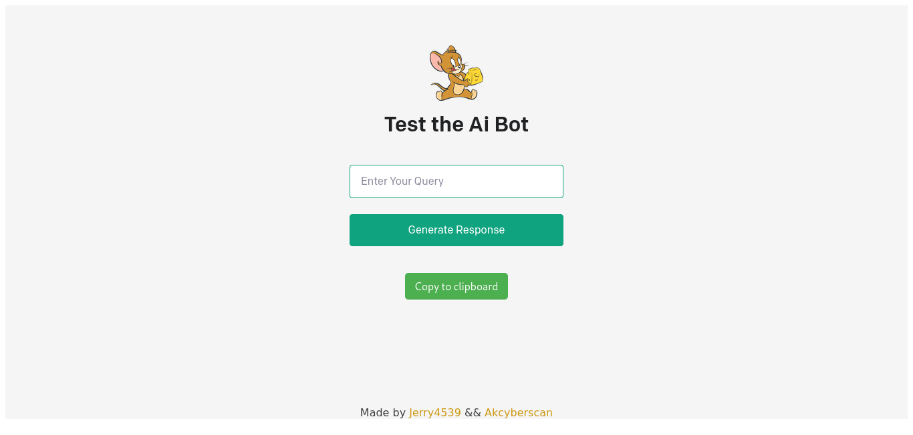

# HelpToCode

This project HelpToCode is Ai Based which help you to generate response my taking Query. Interface was build using with Node.js and Express that uses [OpenAI's Service](https://beta.openai.com/docs/guides/) to generate Response . 

 <a href="https://dull-erin-gharial-hem.cyclic.app/"></a>



## Check How It Is ..

[Help To Code](https://dull-erin-gharial-hem.cyclic.app/)

<i>Click and check its uses</i>

## Pre_Installtion Process

First You have To Make Account On [OpenAI](https://beta.openai.com/) the you have to generate you api key

After that You have to paste this code in `.env` file on root directory


## Instalation Process

Clone the Repositore

```bash
git clone https://github.com/Jerry4539/HelpToCode/
```

Get into the File

```bash
cd HelpToCode
```
Install node modules

```bash
npm install
```

Run server

```bash
npm run dev
```

Open Your FireFox // Any Browser and search for it `http://localhost:5000`. 

## Visit Our Website To Enhance Your Skill

[AkcyberScan](https://jerry4539.online)


<h3>Visitors :</h3>
<br>

<hr>
<br>


